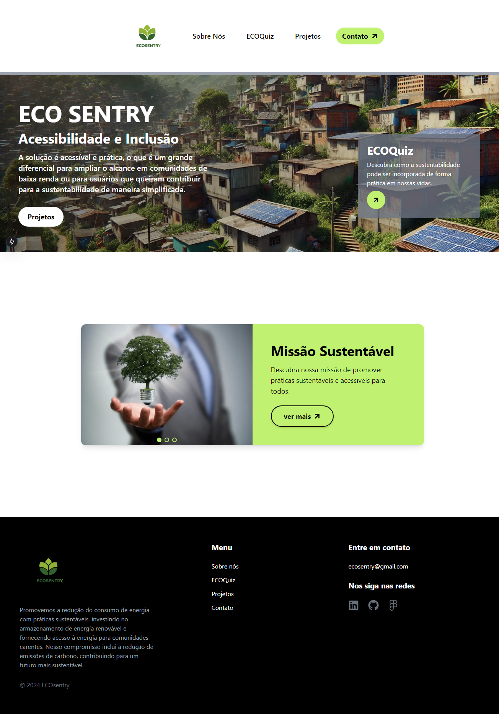

# ECOSENTRY


ECOSENTRY é uma aplicação web desenvolvida para promover o consumo consciente de energia. Através de uma interface acessível, monitoramento de consumo e um sistema de recompensas, o projeto visa engajar os usuários em práticas sustentáveis, incentivando a redução de desperdício de energia.


# ECOSENTRY

ECOSENTRY é uma aplicação web desenvolvida para promover o consumo consciente de energia. Através de uma interface acessível, monitoramento de consumo e um sistema de recompensas, o projeto visa engajar os usuários em práticas sustentáveis, incentivando a redução de desperdício de energia.

## Tecnologias Utilizadas

- **Next.js** - Framework React para desenvolvimento de aplicações web.
- **Tailwind CSS** - Framework de CSS utilitário para criar interfaces rápidas e personalizáveis.
- **React Icons** - Biblioteca de ícones para React.
- **Integração com Java** - Para manipulação de dados relacionados ao consumo de energia e backend.

## Funcionalidades

- Sistema de recompensas baseado no consumo consciente.
- Interface acessível e intuitiva.
- Navegação fácil através de links diretos.

## Instalação

### Pré-requisitos

Antes de começar, certifique-se de ter as seguintes ferramentas instaladas:

- [Node.js](https://nodejs.org/)
- [npm](https://www.npmjs.com/) ou [yarn](https://yarnpkg.com/)

### Passo a Passo

1. Clone o repositório:
   ```bash
   git clone https://github.com/seuusuario/ECOSENTRY.git
